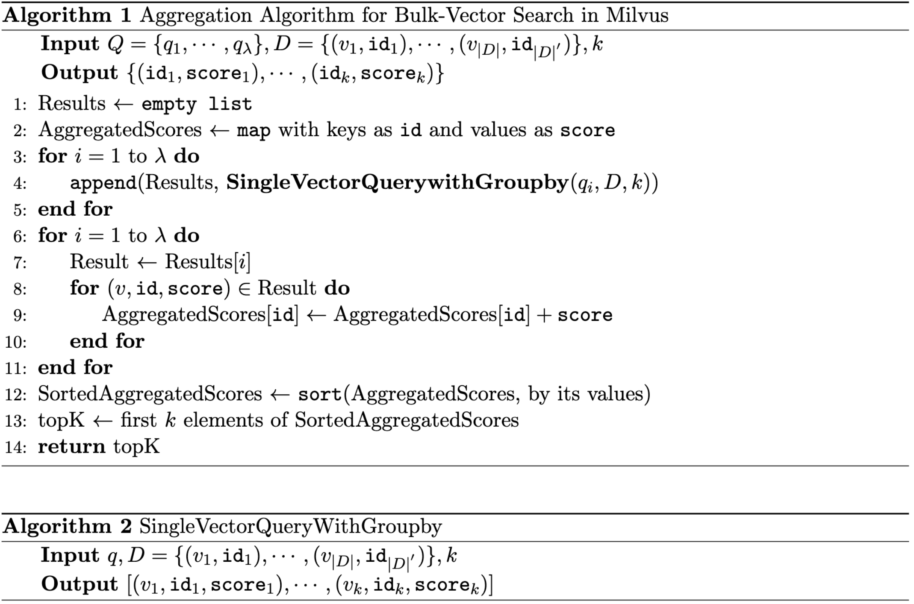

# Advanced Multi-Vector Query Processing in Milvus

## Summary
Support aggregating results of multiple query vectors.

## Background
Multi-vector search is finding k similiar sets of vectors from given a set of vectors (query) among the collection of set of vectors.  
cf. Single vector search is finding k similar vectos from given a vector (query) among the collection of vectors.  
Use case of multi-vector search is late-interaction information retireval model such as [ColBERT [SIGIR'20]](https://arxiv.org/abs/2004.12832).

## Motivation
In lastest Milvus, user have to post-process results from single vector search or bulk-vector search to do multi-vector search.
In this project, we want to eliminate post-processing step in user-side.

## Goals
- Support aggregation of bulk-vector search.

## Non-goals
- Support various SDK interfaces (e.g., Python, Java, etc) (In this implementation, we control the search with dynamic configs by etcd. Matching with various SDKs is another implementation project.)

## Design Details
### Conceptual-level
- Bulk-vector search (without groupby field)
    - Input: $Q=( q_1, \cdots, q_\mu ), D=\{ (v_1, \cdots, v_\mu)_1, \cdots, (v_1, \cdots, v_\mu)_{|D|} \}, k$
    - Output: $\{ ( v_1, \cdots, v_\mu )_1, \cdots, ( v_1, \cdots, v_\mu )_k \}$

- Aggregation Algorithm
    - Input: $Q=( q_1, \cdots, q_\mu ), D=\{ (v_1, \cdots, v_\mu)_1, \cdots, (v_1, \cdots, v_\mu)_{|D|} \}, k$
    - Current output: $\begin{Bmatrix}
\{ (v_1, id_1), & \cdots, & (v_k, id_k)\}_1\\
& \cdots, & \\ 
\{ (v_1, id_1), & \cdots, & (v_k, id_k)\}_\lambda\\
\end{Bmatrix}$
    - Our goal: $ \{ id_1, \cdots, id_k \} $
    - The main algorithm for aggregation is inherited the strategy of [NRA algorithm](https://www.wisdom.weizmann.ac.il/~naor/PAPERS/middle_agg.pdf) (top-k algorithm for relational database)
    - 

### Code-level
Lists of API/struct to modifed
1. PostExecute - internal/proxy/task_search.go
2. type proxyConfig struct - pkg/util/paramtable/component_param.go

Lists of APIs to appended
1. AggSearchResultData - internal/proxy/search_reduce_util.go

New/Added test code
1. TestTaskSearch_AggSearchResultData - internal/proxy/task_search_test.go
2. TestComponentParam - pkg/util/paramtable/component_param_test.go

## Compatibility, Deprecation, and Migration Plan(optional)

Compatible with `v2.4.0`.

## Test Plan

Correctness aspects [✔]
- Verify the ability of aggregation functions (where it does share the same embedding space)
    - TestTaskSearch_AggSearchResultData - internal/proxy/task_search_test.go
    - execute python-query/test_aggregation.py

Performance aspects [✔]
- Perform late-interaction IR model (i.e., Colbert) and compare recall and query latency whether it can achieved comparable results.
    - Dataset: 
        - sampled MS MARCO (Total 15,430 queries, total 0.2M passages, total 1.7M vectors)
    - Comparison group:
        - Faiss: Faiss for single-vector search + post-process (by inverted index)
        - Milvus: Milvus for single-vector search + post-process (by inverted index)
        - Milvus (ours): Milvus for multi-vector search
    - Result:
        |               |   Index  | Query Latency (ms) | Recall | Index File Size (GB) |
        |:-------------:|:--------:|:------------------:|:------:|:--------------------:|
        |     Faiss     |  IVF_PQ  |         187        |  0.91  |         0.41         |
        |     Faiss     |          |         11         |  0.92  |         13.04        |
        |     Milvus    |   HNSW   |         13         |  0.54  |         6.77         |
        | Milvus (ours) |          |         15         |  0.87  |         6.77         |
        |     Faiss     |          |         101        |  0.91  |         8.65         |
        |     Milvus    | IVF_FLAT |        1147        |  0.54  |         5.30         |
        | Milvus (ours) |          |        1375        |  0.87  |         5.30         |

## References
[hybrid_search; control the result based on score](https://stackoverflow.com/questions/76489090/in-weaviate-hybrid-search-is-there-a-way-to-control-the-results-based-on-score)